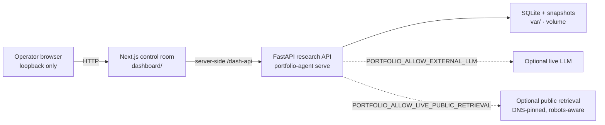
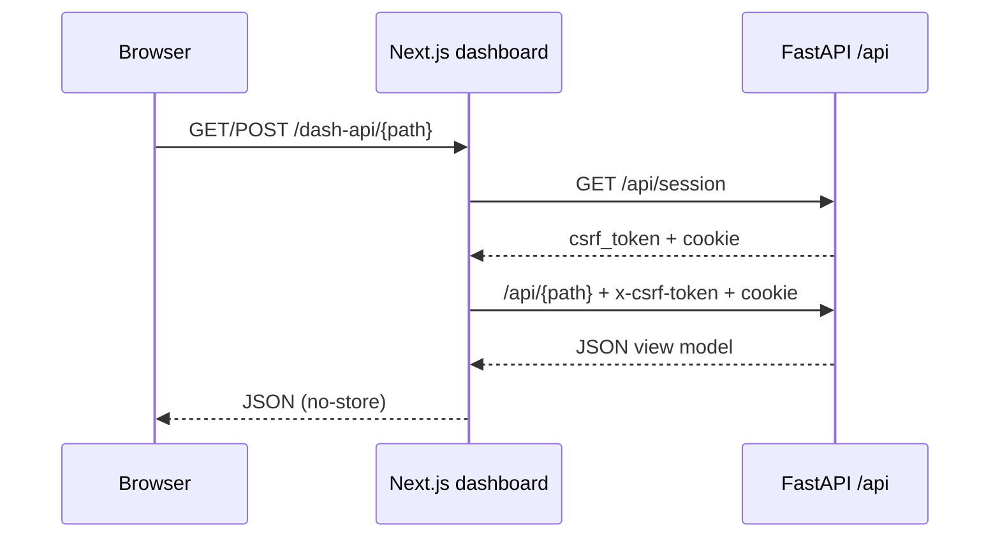
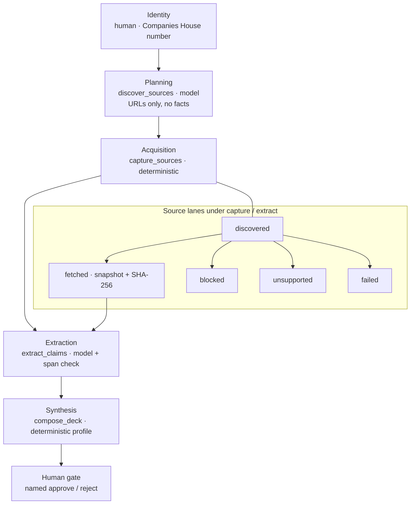
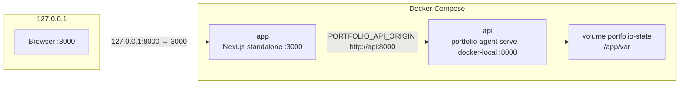

# Company research control room

A local **evidence-first public-company research control room**: a Next.js operator UI plus a bounded FastAPI research API. It binds a case to one Companies House number, runs a staged public-web workflow, admits only verbatim spans from captured snapshots, and stops at a named human gate.

It is not a dissertation archive, a slide exporter, or a public website. The dashboard is loopback-only. The API never accepts a reviewer name from the browser.

## What it is

Operators work a small set of surfaces:

| Surface | Route | Role |
| --- | --- | --- |
| Overview | `/` | Queue: identity holds, executing runs, pending reviews, withheld sources |
| Fixture Overview | `/mock` | Static UI preview; **does not** call the research service |
| Companies | `/companies`, `/companies/[id]` | Intake, identity holds, start a run |
| Reports | `/reports` | In-app library of composed profile versions (no HTML deck download) |
| Execution | `/runs/[id]` | `AgentGraph`: Identity → Planning → Acquisition → Extraction → Synthesis → Human |

Colour on the execution graph and overview stats is **state**, not decoration: pending (dashed), running (accent), awaiting review (human), succeeded/fetched (ok), failed/blocked (fail).

Safe next-action verbs stay specific. The UI never uses a generic **Open**:

- **Resolve holds** — accept or reject an identity claim
- **Start run** — create a bounded research run on a resolved case
- **Review** — approve or reject one profile version
- **Open run** — inspect a persisted run (graph, claims, sources)

Claims enter the ledger only as exact spans of a checksummed snapshot. Composition groups those claims; it does not invent prose. Contradictions are raised, not resolved.

## Who operates it

A **named reviewer** from `PORTFOLIO_REVIEWER_NAME`. Mutations (identity decisions, start/restart/cancel/recover, profile approve/reject) refuse to run until that name is set. The name is taken from process configuration, never from the request body.

Approval is still the only completion gate for a profile version. It records that this reviewer inspected this version (rationale + optimistic lock). It does **not** upgrade held or contradicted evidence.

HTML deck export is gone. After approval, the version stays in the Reports library and on the run page: inspect the graph, claim ledger, and source lanes. There is no download of a generated HTML report.

## Architecture

### System context

The browser talks only to the dashboard. The dashboard’s server process is the only client of the research API. Live model calls and public fetch are optional and dual-gated.



Research mode (`live` / `fixture` / `closed`) is shown in the sidebar boundary tag.

### Request path

Browser fetches `/dash-api/*`. The Next.js route handshakes CSRF with `/api/session`, then forwards to `/api/*`. The FastAPI service is not published on the host in Compose; it only accepts loopback (native) or private container-network clients (`--docker-local`). OpenAPI is disabled.



Dashboard origin for the proxy is `PORTFOLIO_API_ORIGIN` (native default `http://127.0.0.1:8000`; Compose `http://api:8000`).

### Research pipeline

A run cannot start until identity is accepted. The orchestrator then advances one persisted stage per `POST /api/research-runs/{id}/advance`. Source **lanes** hang off Acquisition (capture) and feed Extraction (exact-span admission).



Stage keys in code: `identity` (gate) → `discover_sources` → `capture_sources` → `extract_claims` → `compose_deck` → `human_review` (gate). Source tiers: official register, verified first-party, secondary public, internal document.

The execution page can **Run to review** (advance until the human gate or a non-retryable failure) or **Advance one stage**.

### Compose

Two always-on services. The `test` service is a Compose profile, not part of `up`.



`app` waits until `api` is healthy (`GET /healthz`). Only `app` is published, and only on loopback. Override the host port with `PORTFOLIO_PORT`.

## Repository map

| Path | What it is |
| --- | --- |
| `dashboard/` | Next.js 16 control room (Overview, Companies, Reports, run graph, `/dash-api` proxy) |
| `src/portfolio_agent/` | FastAPI research service: identity, intake, runs, sources, profile decide |
| `alembic/` | Schema migrations; `serve` and `init-db` upgrade to head |
| `fixtures/` | Offline research corpus for `--fixture-research` |
| `tests/` | `unit/`, `integration/`, `e2e/` |
| `data/` | Ignored local imports (see `data/README.md`) |
| `var/` | Ignored runtime DB and snapshots |
| `compose.yaml`, `Dockerfile` | `api` + `app` (+ optional `test` profile) |
| `.env.example` | Compose / native key template — copy, never commit the populated file |
| `dashboard/.env.example` | Native dashboard: `PORTFOLIO_API_ORIGIN` |

CLI (`portfolio-agent` → `portfolio_agent.cli`):

- `init-db` — create/migrate the SQLite database
- `serve` — research API (`--fixture-research`, `--docker-local`, `--host`, `--port`)

## Run locally

Python **3.12**, Node **24**. Copy `.env.example` to `.env` first. Compose interpolates `.env`; native `serve` reads the **process** environment and does not source the file.

### Docker (default)

Set `PORTFOLIO_REVIEWER_NAME` and `OPENAI_API_KEY` in `.env`. Compose **requires** both (`:?` interpolation) and hard-opens live research (`PORTFOLIO_ALLOW_EXTERNAL_LLM` and `PORTFOLIO_ALLOW_LIVE_PUBLIC_RETRIEVAL` are `"true"` in `compose.yaml`).

```bash
docker compose up --build --wait
```

`--wait` blocks until both healthchecks pass. Open http://127.0.0.1:8000/ (the **dashboard**; the API stays on the internal network).

State lives in the `portfolio-state` volume. This path is **live** research, not fixture mode. For synthetic runs with no outbound model or fetch, use native `--fixture-research` instead of Compose.

### Native (dashboard + API)

```bash
python3.12 -m venv .venv
source .venv/bin/activate
python -m pip install -r requirements.lock
python -m pip install --no-deps --editable .

PORTFOLIO_REVIEWER_NAME="Your name" \
PORTFOLIO_ALLOW_EXTERNAL_LLM=true \
PORTFOLIO_ALLOW_LIVE_PUBLIC_RETRIEVAL=true \
OPENAI_API_KEY=… \
portfolio-agent serve --host 127.0.0.1 --port 8000
```

Fixture rehearsal (full workflow, synthetic corpus, no model call and no outbound request):

```bash
portfolio-agent serve --host 127.0.0.1 --port 8000 --fixture-research
```

Dashboard (second terminal):

```bash
cp dashboard/.env.example dashboard/.env.local
npm --prefix dashboard install
npm --prefix dashboard run dev
```

Open http://127.0.0.1:3000 . `/dash-api/*` proxies to `PORTFOLIO_API_ORIGIN` (default `http://127.0.0.1:8000`).

**Port clash:** Compose already binds **host** `8000` to the dashboard. Native `serve` also defaults to `8000`. Do not run both on that port. Either stop Compose, or serve the API on another port and point `dashboard/.env.local` at it. If native `serve` holds `8000`, Compose cannot publish the dashboard there unless you set `PORTFOLIO_PORT`.

### Fixture Overview vs live Overview

| URL | Data |
| --- | --- |
| `/` | Live Overview from `GET /api/overview` |
| `/mock` | Canned `OVERVIEW_MOCK` in the dashboard; banner links back to `/` |

`--fixture-research` is an API mode. `/mock` is a UI preview. They are not the same.

## Environment

Keys only — never put secrets in this file. Populate a private `.env` (`chmod 600`) and keep it uncommitted.

Root `.env.example` (Compose interpolates these; native `serve` needs them in the process env):

- `PORTFOLIO_REVIEWER_NAME` — accountable local reviewer; required for review actions and for live research
- `OPENAI_API_KEY` — required for live research (and for Compose interpolation)
- `PORTFOLIO_ALLOW_EXTERNAL_LLM` — live-research gate (must be open together with live retrieval)
- `PORTFOLIO_ALLOW_LIVE_PUBLIC_RETRIEVAL` — live-research gate (must be open together with the LLM gate)
- `PORTFOLIO_DATABASE_URL`, `PORTFOLIO_RAW_DATA_DIR`, `PORTFOLIO_SOURCE_SNAPSHOT_DIR`
- `PORTFOLIO_OPENAI_MODEL`, `PORTFOLIO_OPENAI_ESCALATION_MODEL`, `PORTFOLIO_OPENAI_REASONING_EFFORT`
- `PORTFOLIO_OPENAI_TIMEOUT_SECONDS`, `PORTFOLIO_HTTP_TIMEOUT_SECONDS`, `PORTFOLIO_HTTP_MAX_RESPONSE_BYTES`, `PORTFOLIO_HTTP_MAX_ATTEMPTS`
- `PORTFOLIO_COMPANY_RESEARCH_MAX_SOURCES`, `PORTFOLIO_COMPANY_RESEARCH_MAX_TOOL_CALLS`, `PORTFOLIO_COMPANY_RESEARCH_MAX_SOURCE_CHARS`, `PORTFOLIO_COMPANY_RESEARCH_MAX_CORPUS_CHARS`, `PORTFOLIO_COMPANY_RESEARCH_MAX_OUTPUT_TOKENS`, `PORTFOLIO_COMPANY_RESEARCH_MAX_REDIRECTS`, `PORTFOLIO_COMPANY_RESEARCH_MAX_ELAPSED_SECONDS`

Compose also reads `PORTFOLIO_PORT` (host publish port, default `8000`).

Dashboard `dashboard/.env.example`:

- `PORTFOLIO_API_ORIGIN` — origin of the research API for `/dash-api`

Live research additionally requires both gates, a public reviewed case, reviewer name, and API key. Opening only one gate is refused at runtime startup.

## Tests

```bash
python -m pip install -r requirements-dev.lock
python -m pip install --no-deps --editable '.[dev]'
python -m pytest
npm --prefix dashboard run typecheck
npm --prefix dashboard run build
```

`pytest` runs `tests/` (`unit`, `integration`, `e2e`) with `--strict-config --strict-markers`. Dashboard scripts: `typecheck` is `tsc --noEmit`; `build` is `next build` (also used in the Docker `dashboard-build` stage).

Optional Compose test image (API package only):

```bash
docker compose --profile test run --rm test
```
